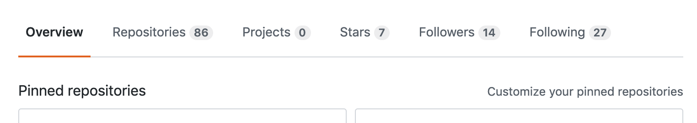
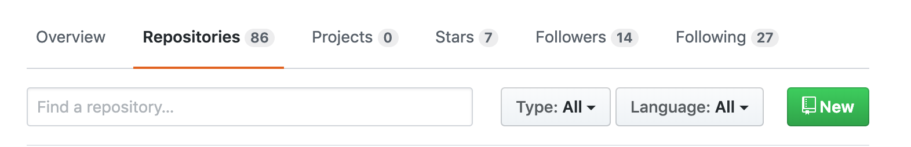
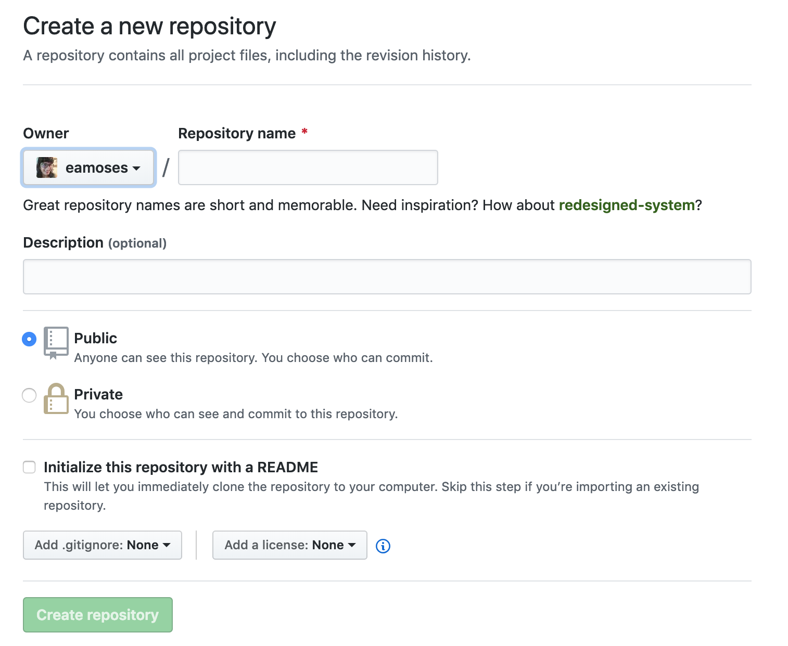
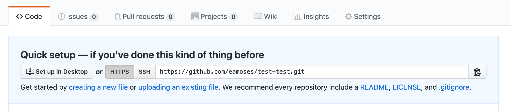

# How to create a new repository for `Checkpoint 2`

1. Navigate to your GitHub page (Example: `www.github.com/yourUsername`)

2. Click on the `Repositories` tab:

3. Click on the green `New` button at the top:

4. In the `Repository name` field put `checkpoint-2` **make sure there are NO spaces in this name**

5. Click the green `Create repository` button at the bottom (You don't have to fill out or check off anything else at this point)

6. Open `Terminal` (on Mac) or `Git Bash` (on Windows) and create a new directory anywhere on your computer that you'd like your code to live.

* To do this with a command, use `mkdir checkpoint2` to create a new `checkpoint2` folder. **This is important, we do not want to create a directory inside our old git repository locally. We want this to be a completely separate folder**

7. `cd` into that folder, and then type `git clone https://github.com/yourUsername/checkpoint-2.git`

**The URL above will be copy and pasted from the creation of your GitHub repository.**

* The image below illustrates the URL to copy, it should start with `HTTPS`

8. `cd` into `checkpoint-2` after you have successfully cloned it.

9. Type `code .` to open VS Code

10. Start coding!  You can branch from here, add your first `index.html` files and use normal `git` workflow.

**Note: Since we created a brand new GitHub repository and linked it locally on our machines in git, every time we `git add .`, `git commit -m` and `git push` it will be pushed directly to our NEW repository.**
